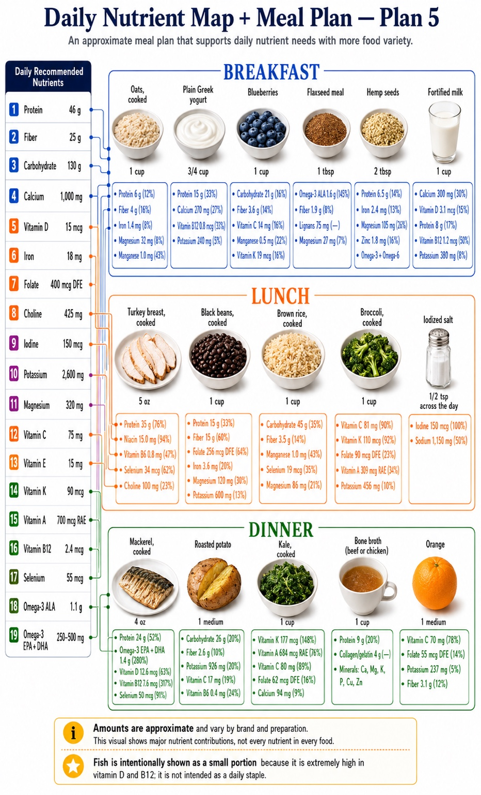

# goodfood

A production-quality **nutrition meal-planning web app**. Give it a full day's desired nutrition
(defaulting to your profile's recommended daily intake), tell it which ingredients you already have,
and it recommends breakfasts, lunches, and dinners that meet your nutritional constraints — **with a
source-linked proof table** showing the ingredients, portions, and how much of each nutrient every
food contributes.

> **Honest by design.** The app never promises to hit targets "exactly." Each nutrient is modeled as
> **disabled / minimum / target / maximum** with a tolerance, so it can truthfully say: *"This plan
> meets all hard constraints and lands within your chosen target ranges."*

The core screen is modeled on this reference layout — a daily nutrient map plus a meal plan where
every food shows its major nutrient contributions and % of daily target:



## Features

- Daily nutrient targets (default to recommended intake) with **per-nutrient customization** —
  raise protein, disable a vitamin, set a range.
- **Use what you have** — list your ingredients and get plans built around them.
- Full **breakfast / lunch / dinner** recommendations with per-ingredient portions.
- **Source-linked nutrient proof table** for every plan.
- **Shuffle** an ingredient or meal for an alternative; **pin** an ingredient and reshuffle the rest
  to still meet constraints.
- **Shopping-list** generation; **printable** plan pages.
- Plan over a **day, week, N weeks, or month**; **save** plans (with immutable nutrition snapshots).
- **Banned foods & allergy exclusions** as absolute constraints; **dietary patterns** (vegan,
  vegetarian, pescatarian, non-dairy, whole-foods, paleo, keto, …).
- **Calorie budget** and **macronutrient targets** per day / N days / week; optional randomization.
- **Feasibility guidance** — when a settings combination is impossible, explain why and suggest what
  to adjust.
- **Nutrient reference** — browse each daily-recommended nutrient and the foods rich in it.

## Tech stack

- **Monorepo:** pnpm + Turborepo
- **Web:** Next.js (App Router), TypeScript **strict**, Tailwind CSS — deployed on **Vercel**
- **Database:** Neon PostgreSQL + Prisma
- **Solver:** Python 3.12 + FastAPI + OR-Tools — a **separate containerized service**
- **Validation & tests:** Zod · Vitest (TS) · pytest (Python) · Playwright (E2E)

## Data sources

- **Food facts:** [USDA FoodData Central](https://fdc.nal.usda.gov/) is the canonical nutrient
  source (CC0 / public domain, API-friendly). Normalized food snapshots are cached in Neon.
- **Nutrient targets:** authoritative DRI / FDA Daily Value references, keyed to the user's profile —
  distinct from food facts.
- Nutrition data is never fabricated; synthetic fixtures are labeled as such. Missing nutrient data
  is **not** treated as zero.

## Repository layout

```
apps/web/           Next.js frontend + API routes            (planned)
apps/solver/        FastAPI + OR-Tools optimization service  (planned)
packages/db/        Prisma schema, client, migrations        (planned)
packages/nutrition/ nutrient math & data-quality logic       (planned)
packages/contracts/ shared Zod schemas (web ↔ solver)        (planned)
docs/               phase-brief, architecture, roadmap, assets
```

## Documentation

| Doc | What it covers |
|-----|----------------|
| [docs/phase-brief.md](docs/phase-brief.md) | Standing brief: tech stack, the 10 product invariants, per-phase engineering contract |
| [docs/architecture.md](docs/architecture.md) | System design, product scope, the plan-view reference layout, data model principles |
| [docs/roadmap.md](docs/roadmap.md) | Per-phase log: what shipped, remaining gaps, migration notes |
| [CLAUDE.md](CLAUDE.md) / [AGENTS.md](AGENTS.md) | How agents operate in this repo (autonomy, orchestration, Linear workflow, code intelligence) |

## Development

The app is being built **incrementally, one phase at a time**. Setup instructions (install, env,
migrations, run) will be filled in as the scaffolding and each service land — see
[docs/roadmap.md](docs/roadmap.md) for current status.

Secrets live in a gitignored `.env` (never committed). Database changes go through Prisma
**migrations** — databases are never reset or destroyed.

## Project tracking

Work is tracked in Linear (workspace **GoodFoodApp**, team key **`GOO`**) at
[linear.app/goodfoodapp](https://linear.app/goodfoodapp).
