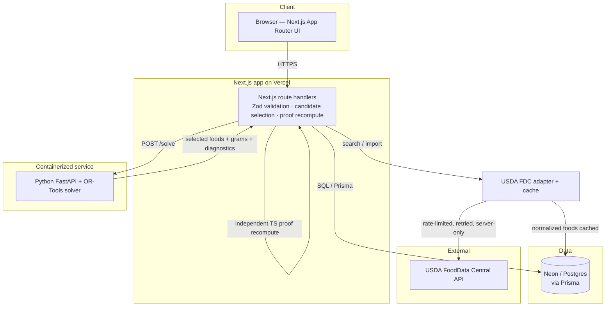
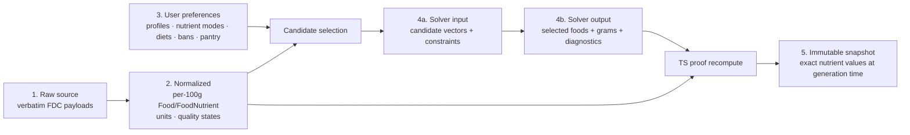

# Architecture — goodfood

> System design for the goodfood nutrition meal-planning app. Product rules and the stack live in
> [phase-brief.md](phase-brief.md) (the canonical invariants); this file describes **how the pieces
> fit**. Keep it truthful — update it in the same change that alters the design (CLAUDE.md §4.7).
> Sections marked *(planned)* are not built yet; fill them in as phases land.

## Stack (see [phase-brief.md](phase-brief.md#tech) for the authoritative list)

pnpm + Turborepo monorepo · Next.js App Router (TS strict) + Tailwind · Neon Postgres + Prisma ·
Python 3.12 + FastAPI + OR-Tools solver · Vercel (web) + containerized solver · Zod · Vitest ·
pytest · Playwright.

## System diagram



Three outward edges from the route handlers, exactly as required: **→ Neon/Postgres**, **→ Python
solver**, **→ USDA FDC adapter/cache**. The USDA key and DB credentials live only server-side; the
browser never sees them.

## Data lineage — five separated representations

The system keeps these five stages distinct (product rules 3–5). See
[product-spec.md §10](product-spec.md#10-data-lineage-five-distinct-stages).



- **Raw ≠ normalized:** raw FDC payloads are retained for traceability but never rendered; the UI
  reads normalized per-100 g data.
- **Preferences ≠ solver input:** preferences are user intent; solver input is the compiled candidate
  set + constraint vector derived from them (banned/diet-filtered *before* the solver — rule 7).
- **Solver output ≠ proof:** the solver returns **only** selected foods/grams; TypeScript independently
  recomputes the nutrient proof and **rejects** solver output that fails verification.
- **Snapshot ≠ live data:** a saved plan freezes the exact nutrient values used, so later food-data
  edits never mutate historical plans (rule 5). Every `PlanRevision` is immutable + auditable.

## Product scope

A meal planner that takes a full day's desired nutrition (default: recommended daily intake),
lets the user adjust each nutrient, factors in ingredients they already have, and recommends
breakfasts/lunches/dinners meeting the constraints — **with a source-linked proof table**, plus
per-ingredient portions and per-nutrient amounts. Target feature set (built incrementally, per
phase):

- **Nutrient model:** each nutrient is **disabled / minimum / target / maximum**, each with a
  **tolerance** (product rule 6/8). Disabling ≠ zero. Honest claim only — "meets all hard
  constraints and lands within your chosen target ranges."
- **Constraints & diets:** banned foods and allergy exclusions are absolute (rule 7); dietary
  patterns (vegan, vegetarian, pescatarian, non-dairy, whole-foods, paleo, keto, …); calorie budget
  and macronutrient targets per day / N days / week.
- **Planning:** generate plans over a day → week → N weeks → month; save plans (immutable snapshots,
  rule 5); printable plan pages; shopping-list generation.
- **Interactivity:** shuffle an ingredient/meal for an alternative; pin an ingredient and reshuffle
  the rest to still meet constraints; enable randomization for variety.
- **Feasibility:** when a settings combination is infeasible, **explain why and recommend what to
  adjust** (never silently fail or fabricate).
- **Nutrient reference:** browse every nutrient (focus on daily-recommended set) with readable
  info on which foods are rich in it.
- **Images:** per-ingredient thumbnails — **licensed sources only**, no scraping/hotlinking (rule 10).

Data sourcing: **USDA FoodData Central** is canonical (CC0 / public-domain, API-friendly); normalized
food snapshots are cached in Neon. The **solver stays separate from the web UI**.

## Plan view — canonical reference layout

The core output screen is modeled on the user's reference infographic
([docs/assets/plan-view-reference.jpeg](assets/plan-view-reference.jpeg), *"Daily Nutrient Map +
Meal Plan — Plan 5"*). This is the **source-linked nutrient proof table** (product rule 9) rendered
as a UI. Structure:

- **Left rail — Daily Recommended Nutrients:** an ordered list of the target nutrients, each with a
  target amount + unit. The reference shows 19 (Protein 46 g, Fiber 25 g, Carbohydrate 130 g,
  Calcium 1000 mg, Vitamin D 15 mcg, Iron 18 mg, Folate 400 mcg DFE, Choline 425 mg, Iodine
  150 mcg, Potassium 2600 mg, Magnesium 320 mg, Vitamin C 75 mg, Vitamin E 15 mg, Vitamin K 90 mcg,
  Vitamin A 700 mcg RAE, Vitamin B12 2.4 mcg, Selenium 55 mcg, Omega-3 ALA 1.1 g, Omega-3 EPA+DHA
  250–500 mg). **Units are heterogeneous** (g / mg / mcg / mcg DFE / mcg RAE) and **targets can be
  ranges** (e.g. EPA+DHA 250–500 mg) — the data model must carry unit + min/target/max per nutrient
  (rule 6/8).
- **Nutrient map:** connector lines link each left-rail nutrient to the foods that contribute it —
  the "map." Model as edges {nutrientId → ingredientId} derived from the contribution data.
- **Meal sections — Breakfast / Lunch / Dinner:** each contains ingredients.
- **Ingredient card:** thumbnail (licensed source only, rule 10) · name (e.g. "Oats, cooked") ·
  **portion** as a household measure (`1 cup`, `3/4 cup`, `1 tbsp`, `2 tbsp`, `5 oz`, `1 medium`,
  `1/2 tsp across the day`) — normalize to grams internally for the per-100 g math · and a list of
  **nutrient contributions**: `{nutrient, amount, unit, %DV}` e.g. *Protein 6 g (12%)*.
- **Percent-of-daily (%DV):** each contribution shows its share of the daily target. When a nutrient
  has **no established DV** (e.g. Lignans, "Omega-3 + Omega-6", Collagen/gelatin), show **"—"**,
  **never 0%** or a fabricated number — this is product rule 4 (missing/undefined ≠ zero) surfaced in
  the UI.
- **Honesty footnotes (must ship):** *"Amounts are approximate and vary by brand and preparation.
  This visual shows major nutrient contributions, not every nutrient in every food."* and portion
  caveats (the reference notes fish is a deliberately small portion — very high in vitamin D/B12, not
  a daily staple). This reinforces rules 2/4/6 and the "no literal exact" claim.

**Default targets are profile-dependent.** The reference numbers correspond to a specific
adult profile (they align with NIH DRI RDA/AI values for an adult female). Defaults must therefore be
derived from an **authoritative reference (FDA Daily Values / NIH ODS DRIs) keyed by the user's
profile** — the infographic's values are illustrative, not the canonical target source, and must not
be hardcoded as universal (rule 2: never fabricate). Food *facts* still come from USDA FDC (rule 1);
nutrient *targets* come from the DRI/DV reference — two distinct sources.

## Monorepo layout *(planned — establish in the scaffolding phase)*

```
apps/
  web/           Next.js App Router frontend + API routes (Vercel)
  solver/        Python FastAPI + OR-Tools optimization service (containerized)
packages/
  db/            Prisma schema, client, migrations (Neon Postgres)
  nutrition/     domain logic: nutrient math, per-100g normalization, data-quality states
  contracts/     shared Zod schemas / API contract types (web ↔ solver)
docs/            phase-brief, architecture, roadmap, decisions
```

Flat `apps/*` and `packages/*` siblings — no loose root dirs (CLAUDE.md §4.3).

## Data model principles *(planned)*

Driven by product rules 3–5 in [phase-brief.md](phase-brief.md#core-product-rules-invariants--never-trade-away):

- Nutrient facts stored **per 100 g**, with `sourceFoodId`, `sourceVersion`/date, `unit`, and a
  **data-quality state** (e.g. `measured` / `imputed` / `missing`). Missing ≠ 0 (rule 4).
- Saved plans carry an **immutable nutrition snapshot** (rule 5) — historical plans never mutate
  when USDA data updates.
- USDA FoodData Central is the canonical source (rule 1); synthetic fixtures are labeled as such
  (rule 2).

## Optimization service *(planned)*

FastAPI + OR-Tools. Hard constraints: banned foods & allergy exclusions are absolute (rule 7);
disabling a nutrient **removes** it from the model (rule 8, not a zero-max). "Exact" = all enabled
hard constraints satisfied within displayed tolerances (rule 6). Every result feeds a
**source-linked nutrient proof table** (rule 9).

## Web ↔ solver contract *(planned)*

Shared Zod schemas in `packages/contracts`. The web app validates all I/O with Zod; the solver
validates its request payloads. Nutrient proofs returned by the solver link back to source food IDs.

## Decisions

Architectural decisions live as ADRs in [docs/adr/](adr/), cross-linked to their Linear issue/project.

- [ADR-001 — Nutrition data source](adr/001-nutrition-data.md): USDA FDC canonical; Foundation/SR
  Legacy prioritized; missing ≠ zero; raw payloads retained for provenance.
- [ADR-002 — Optimization approach](adr/002-optimization.md): OR-Tools CP-SAT, gram-increment
  portions, strict + diagnostic-relaxed modes, timeout ≠ infeasible, TS is the canonical proof.
- [ADR-003 — Nutrition targets](adr/003-nutrition-targets.md): targets from FDA DV / NIH DRI keyed by
  profile (distinct from food facts); disabled/minimum/target/maximum modes; tolerances & UL handling.
